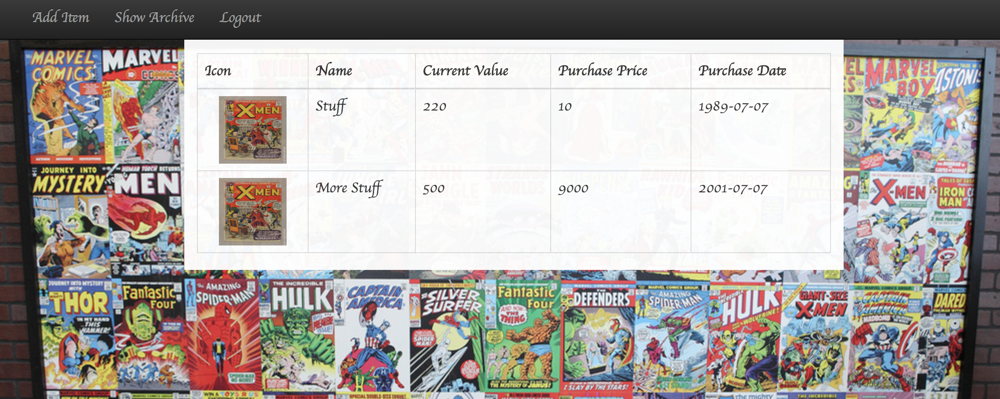
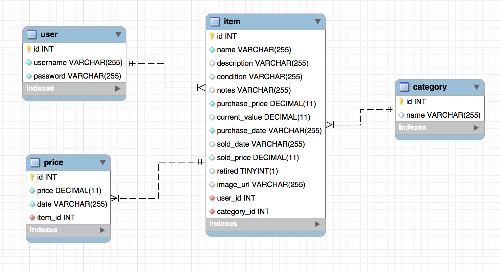

# Collectors
An AngularJS Spring REST API web application where item collectors can keep track of their collected items and check current market value

## In This Document:
1. [Application URL](#application-url)
2. [How to Use the Application](#how-to-use-the-application)
3. [Technologies Used](#technologies-used)
4. [Data Model](#data-model)
5. [Future Feature Sets](#future-feature-sets)
6. [Stumbling and Learning Points](#stumbling-and-learning-points)

## Application URL
http://shaundashjian.com:8080/Collectors/

## How to Use the Application
* User logs in with email and password
* The landing page lists all collector's items with total current value
* User could pull the latest data of the current value for all items form eBay
* User could select an item to view more details, with options to update and archive
* The naviagtion bar privides options to add new items, view archive, or logout

## Technologies Used
  * AngularJS
  * Spring REST web services
  * Consumption of a 3rd-party API
  * AJAX
  * Java
  * HTML, CSS, JavaScript, and jQuery
  * JPA and Hibernate
  * MySQL

## Data Model

## Future Feature Sets:
  * Show how collection value imorved over time   
  
## Stumbling and Learning Points:
  * Learning how to consume data from a 3rd-party API
  

[Up](README.md)
