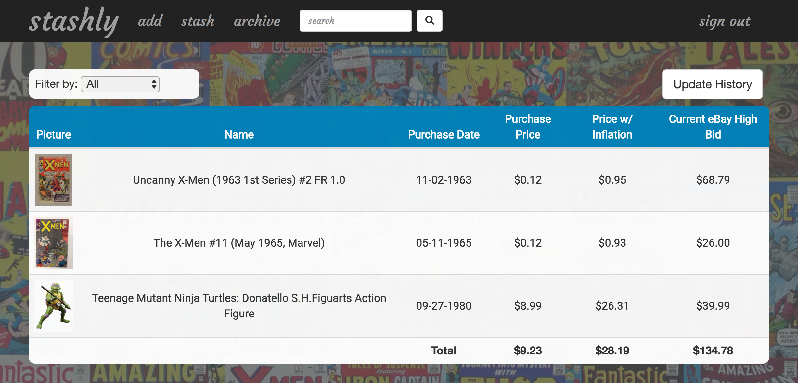
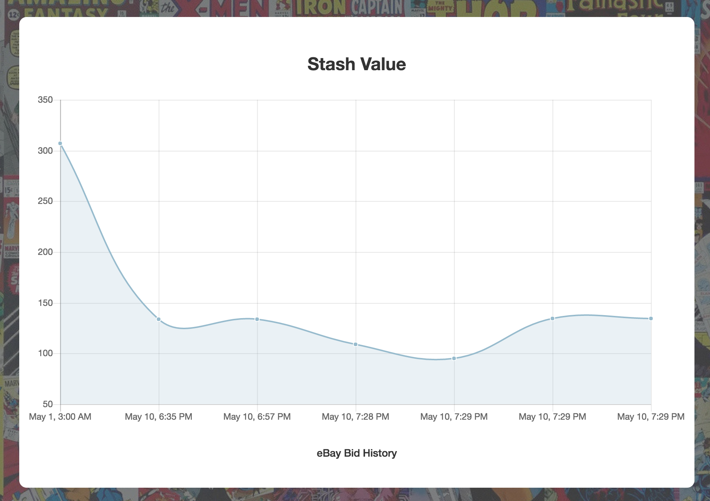
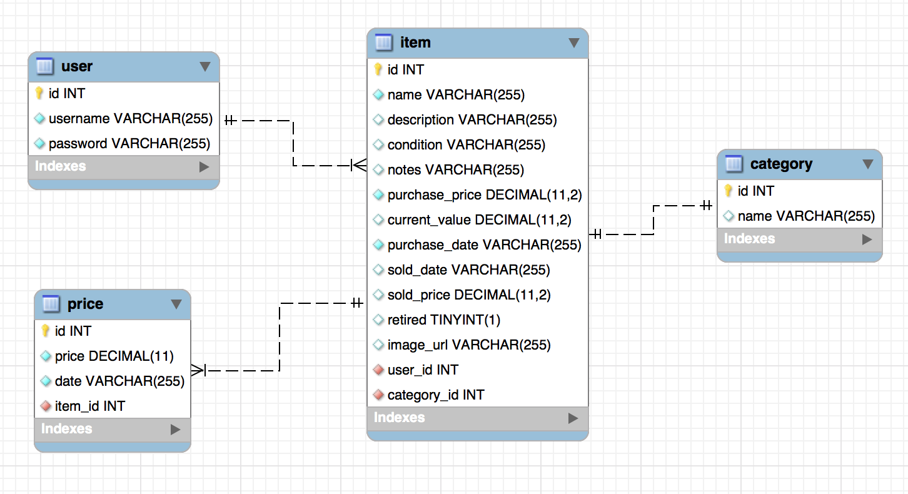

# Stashly
An AngularJS Spring REST API web application where item collectors can keep track of their collectables and check their current market value on eBay using eBay API.

## In This Document:
1. [Application URL](#application-url)
2. [How to Use the Application](#how-to-use-the-application)
3. [Technologies Used](#technologies-used)
4. [Data Model](#data-model)
5. [Future Feature Sets](#future-feature-sets)
6. [Stumbling and Learning Points](#stumbling-and-learning-points)

## Application URL
http://shaundashjian.com:8080/stashly/

## How to Use the Application
* User logs in with username and password
* The landing page shows the user stash, all collectables with total current value, adjusted inflaton value, and graphical representation of bid history
* User could pull the latest data of the current value for all items from eBay
* User could filter to only view items of a particular category
* User could search for a specific category using keywords
* User could select an item to view more details, with options to update and archive
* The naviagtion bar provides options to add new items, view archive, and logout

## Technologies Used
  * AngularJS
  * Spring REST web services
  * Consumes data from two 3rd-party APIs
  * AJAX
  * Java
  * HTML, CSS, Bootstrap, JavaScript, and jQuery
  * ChartJS library
  * JPA and Hibernate
  * JDBC
  * MySQL

## Data Model

## Future Feature Sets:
  * Link items directly to eBay so that user could sell them
  * Social aspects so that users could compare their stashes
  * Get data from other eCommerce sites
  * Develop the application as a smart phone app that uses RFID technology to scan item barcode and fill details automatically

## Stumbling and Learning Points:
  * Learning how to consume data from a 3rd-party API
  * Reserved words, specifically with MySQL
  * Cascading delete from one table in the database to others
  * Implementing graphs using ChartJS library
  

[Up](README.md)
